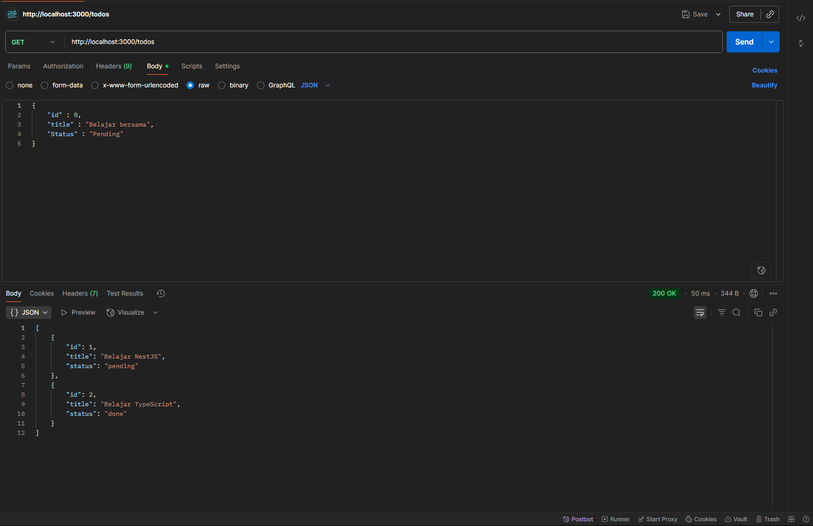
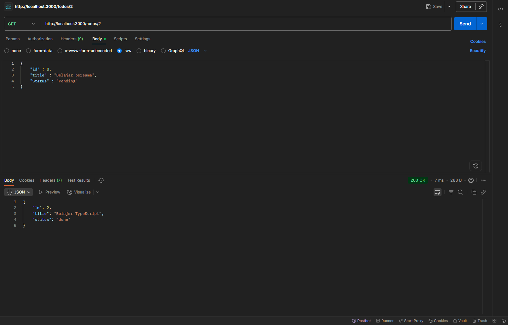
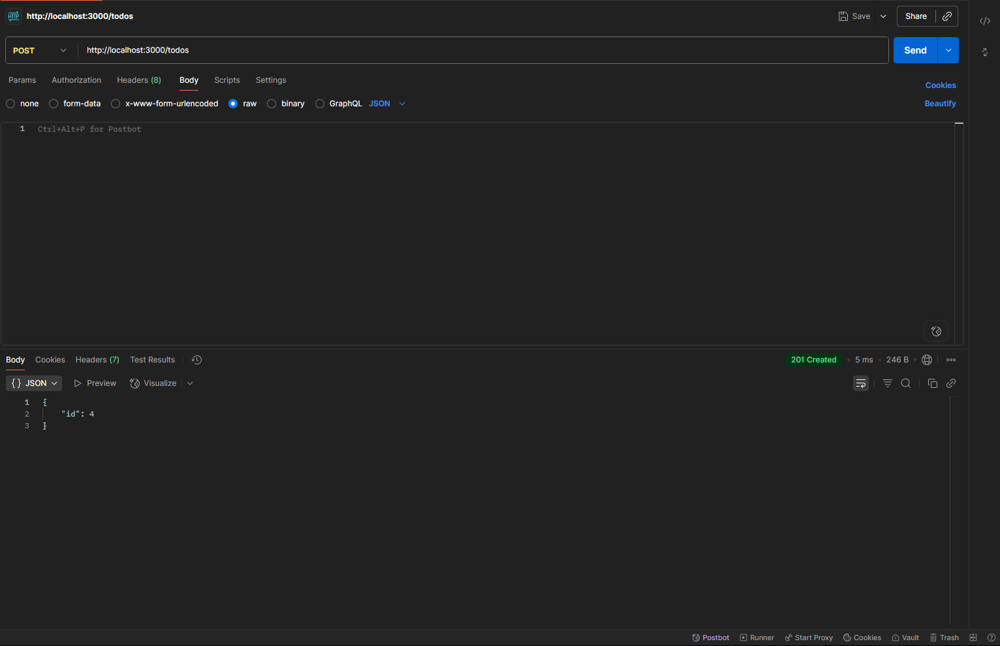
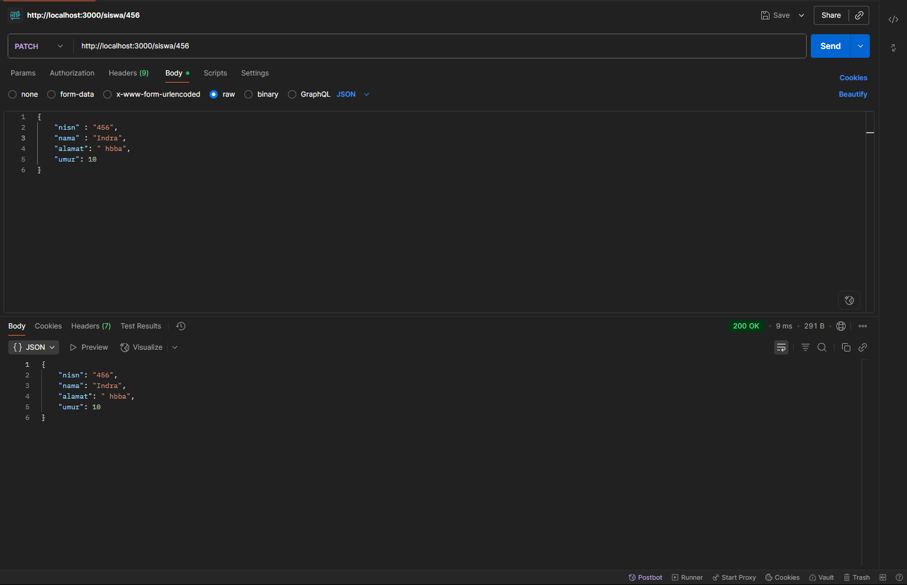
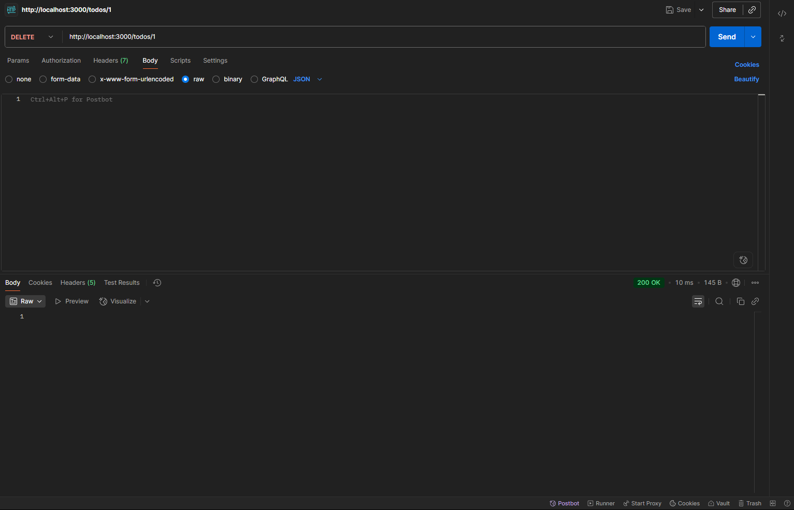

# 📝 API Todo List - NestJS

API ini adalah implementasi sederhana daftar siswa menggunakan **NestJS** tanpa database.
Semua data disimpan di dalam array agar mudah dipahami dan diujikan menggunakan **Postman**.
Proyek ini dibuat untuk memenuhi tugas pembuatan resource siswa dan membuat crud sederhana tanpa db.

## 👤 Identitas
Nama: Ahmad Fauzan
Kelas: XI RPL 1

## 📜 Deskripsi
API siswa sederhana menggunakan NestJS tanpa database. Data disimpan di dalam array.

## ✨ Fitur Utama
- **GET /siswa** → Menampilkan semua siswa
- **GET /siswa/:nisn** → Menampilkan siswa berdasarkan nisn
- **POST /siswa** → Menambahkan siswa baru
- **PUT /siswa/:nisn** → Mengupdate siswa berdasarkan nisn
- **DELETE /siswa/:nisn** → Menghapus siswa berdasarkan nisn

## 🗂️ Struktur Data
Setiap todo memiliki struktur data berikut:

{
  "id": number,
  "title": string,
  "status": "pending" | "done"
}

## 🖼️ Screenshot

